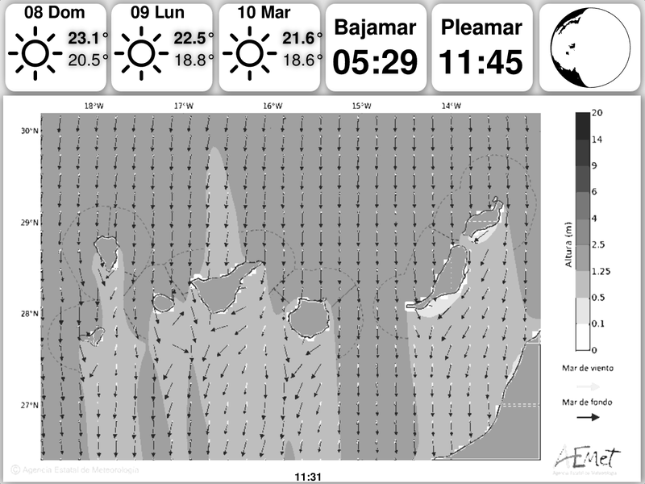

# kindle-bueno standalone weather dashboard

**Forked from: [https://github.com/Aveygo/KindleDashboard](https://github.com/Aveygo/KindleDashboard)**

#### Standalone weather dashboard

Runs as an armv7 static binary entirely on its own on the kindle - no additional server needed.



## Features
 - 🌦️ 3 day weather prediction from [openweathermap](https://openweathermap.org/)
 - 🏝️ Local AEMET coast map with surface waves and currents waves mapped to grayscale
 - 🌊 Nearest two tides from [Instituto Hidrográfico de la Marina](https://armada.defensa.gob.es/ArmadaPortal/page/Portal/ArmadaEspannola/cienciaihm1/prefLang-es/02ProductosServicios--045PrevisiondeMareas)
 - 🌘 Moon phase for fish astrology
 - 🕗️ Last update time
 - 👷‍♀️ **Incredibly** non-future proof (more scraping than apis)

## Setup
You **really** need to hack a bit, everything is centered around Lanzarote island and sea weather.

See the original project for more stuff like news, calendar integration, and ticker stats: [https://github.com/Aveygo/KindleDashboard](https://github.com/Aveygo/KindleDashboard).

### Requirements
You will need a jailbroken kindle with ssh enabled. Make sure that it has ```xrandr``` and ```eips```. Should work on almost any kindle that has these scripts, but I've only tested on a kindle paperwhite 5th gen (I have tested on a KT2 / Kindle Basic Touch).

### Building
1. ```git clone``` this repo.
2. Install rust/cargo & [Cross](https://github.com/cross-rs/cross) and build the project with: ```RUSTFLAGS="-C target-feature=+crt-static" cross build --target arm-unknown-linux-musleabi --release```. This is the only reliable way of building for the kindle. I sadly could not get [cargo crane](https://crane.dev) to work, specifically to compile an entirely static binary. Cargo cross uses docker instead of ❄️nix.

### Config
1. OpenWeatherMap - Create an [API](https://openweathermap.org/api) account. Save the api token in sensitive/openweatherkey.json as ```{"key":"MYKEY"}```
2. Others - The tides and map locations are hardcoded - happy hacking!

### Running locally

Just `cargo run`, check stdout logs, and open `output.png` - a pretty fast dev cycle.

### Deploy

Something like this, depends on your setup:

```sh
cross build --target armv7-unknown-linux-musleabihf --release 
ssh root@kindle
killall kindle-bueno
exit
scp ./target/armv7-unknown-linux-musleabihf/release/kindle-bueno root@kindle:/mnt/us/
ssh root@kindle
cd /mnt/us
nohup kindle-bueno
exit
```

To watch the logs on the kindle, just run it without `nohup`.

## Caveats

 - You ***really* should** check through the logs on the initial run for any misconfigs / failed runs / incomplete data (step 3 of running).
 - The map image is "scraped" from AEMET and specific to the Canary Islands.
 - AEMET does have a proper API, but it's more low-level, and the image is just perfect. It needs no API key, so it may not be stable.
 - Very unstable and not future proof, but at least it shouldn't **all** break at the same time thanks to rust.
 - No "low power mode" with screenshots or sleepmode. Best to keep the kindle plugged in.

## TODO
 - Caching so we don't need to fetch the linux kernel version / weather / FRED data every 15 minutes.
 - Moving from `nohup` to something like systemd and/or a KUAL entry.

## Personal Notes

Also, for any others following in my footsteps, the kindle is more like an embedded device rather than a raspberry pi - don't expect a lot (if any) from it, and definately don't try web-engine based rendering.
